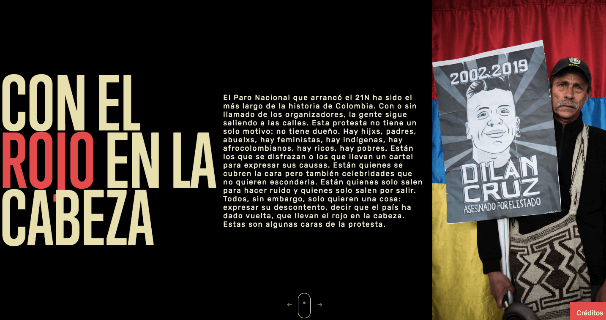

# Con el Rojo en la Cabeza

https://cerosetenta.uniandes.edu.co/con-el-rojo-en-la-cabeza/

En esta iniciativa participaron más de 85 personas que fueron fotografiadas en las jornadas del 21, 25, 27 de noviembre y el 4 de diciembre del Paro Nacional en Bogotá. Las frases corresponden a los motivos por las cuales ellos salieron a marchar. Algunos no quisieron decir nada. No incluimos los nombres de los participantes por respeto a su privacidad. Las fotos y la producción fueron realizadas por Tomás Mantilla, estudiante de sexto semestre de historia en la Universidad de los Andes. El diseño es de Juan Camilo González, profesor del Centro de Estudios en Periodismo, Ceper, de la Universidad de los Andes.
