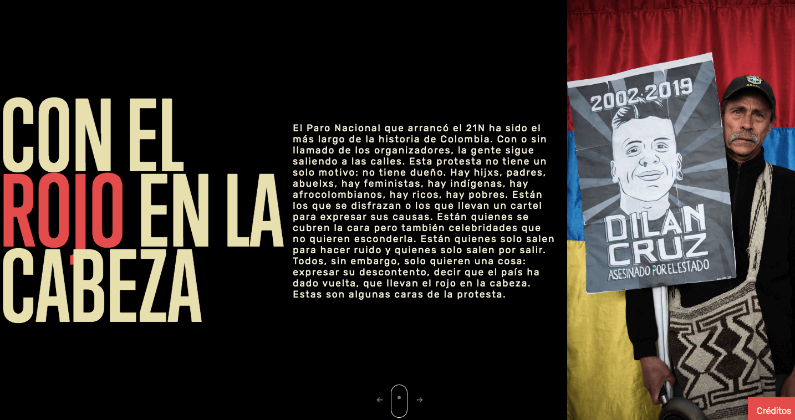

# Con el Rojo en la Cabeza

https://cerosetenta.uniandes.edu.co/con-el-rojo-en-la-cabeza/



En esta iniciativa participaron más de 85 personas que fueron fotografiadas en las jornadas del 21, 25, 27 de noviembre y el 4 de diciembre del Paro Nacional en Bogotá. Las frases corresponden a los motivos por las cuales ellos salieron a marchar. Algunos no quisieron decir nada. No incluimos los nombres de los participantes por respeto a su privacidad. Las fotos y la producción fueron realizadas por Tomás Mantilla, estudiante de sexto semestre de historia en la Universidad de los Andes. El diseño es de Juan Camilo González, profesor del Centro de Estudios en Periodismo, Ceper, de la Universidad de los Andes.

## Apropiación

Usted puede usar el código de este proyecto para crear su propia galería de imágenes. Para hacerlo puede seguir los siguientes pasos.

### Instalar aplicaciones de desarrollo

- NodeJS (recomendado instalar la versión LTS): https://nodejs.org/
- Git: https://git-scm.com/downloads
- Visual Stuido Code (o cualquier editor de código): https://code.visualstudio.com/

### Hacer copia del repositorio en su cuenta de Github

Si no tiene cuenta en https://github.com/ puede crear una gratuita.

Luego de iniciar la cuenta, puede hacer un **Fork** de este repositorio a su cuenta.

Va a https://github.com/1cgonza/con-el-rojo-en-la-cabeza y hace clic en el botón _Fork_ en la parte superior.

### Clonar el repositorio

Desde la terminal, ir a la carpeta donde quiere guardar el proyecto y correr el comando:

:exclamation: Cambiar las siguientes partes del comando:

- Donde dice `1cgonza`, cambiar por su nombre de usuario en Github.
- Donde dice `nombre-de-su-proyecto`, cambiar por el nombre que le quiere dar a la carpeta que se va a crear con el código):

```bash
git clone https://github.com/1cgonza/con-el-rojo-en-la-cabeza.git nombre-de-su-proyecto
```

### Entrar a la carpeta

El comando anterior crea una carpeta en su computador, ahora entramos a ella para instalar dependencias y comenzar a editar.

```bash
cd nombre-de-su-proyecto
```

### Instalar dependencias

Solo lo tiene que hacer una vez, luego de tener instaladas las dependencias en su proyecto ya puede ejecutar el código sin volverlas a instalar.

```bash
corepack enable
```

```bash
yarn install
```

### Iniciar servidor de desarrollo local

En Visual Studio Code, abra la carpeta del proyecto para editar.

En la terminal, correr el siguiente comando para iniciar un servidor local donde puede ver los cambios.

```bash
yarn dev
```

Abrir este enlace en el explorador: http://localhost:3000/

### Detener servidor local

Cuando ejecutamos el comando `yarn dev` la terminal queda ocupada por el servidor, para detenerlo va a la terminal y presiona en el teclado: **CTRL+C**.

## Cambiar las imágenes

Este proyecto extrae las imágenes desde Flickr. Por ejemplo, la colección para "Con el Rojo en la Cabeza" esta en https://www.flickr.com/photos/185741681@N03/

Para cambiar la fuente de imágenes, necesitamos el `user_id` de una cuenta en Flickr. Ese ID esta en la url.

Para: https://www.flickr.com/photos/185741681@N03/

El `user_id` es: **185741681@N03**

Este lo pegamos en el archivo ubicado en `fuente/utilidades/Flickr.js`.

Al principio de este archivo va a encontrar el siguiente bloque donde puede cambiar el `user_id` de fotos:

```js
const parametros = {
  method: 'flickr.people.getPublicPhotos',
  user_id: '185741681@N03', // Cambiar para usar otra colección de fotos.
  api_key: '2512f39372e99a27a692abc3bae34fde',
  nojsoncallback: '1',
  // per_page: '10',
  extras: 'o_dims,url_o,url_k,description',
  format: 'json',
};
```

## Textos sobre las imágenes

Los textos que acompañan cada imagen en la galería vienen de la descripción de la foto en Flickr, para editarlas, edite la descripción directamente en Flickr.

## Textos de título, introducción y créditos

Estos textos los puede editar en el archivo `index.html`.
